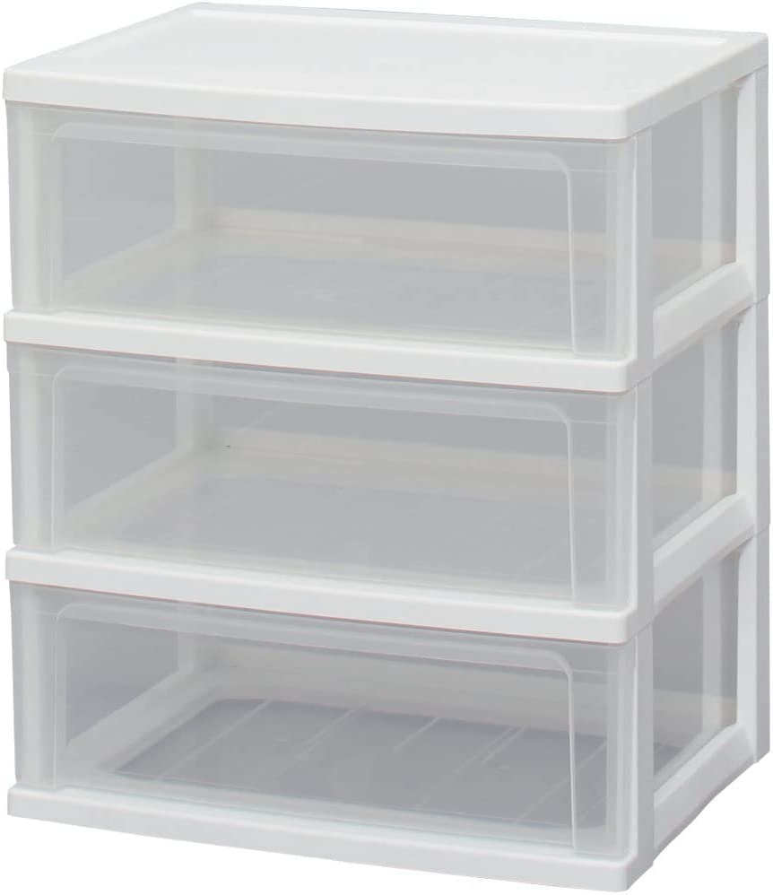
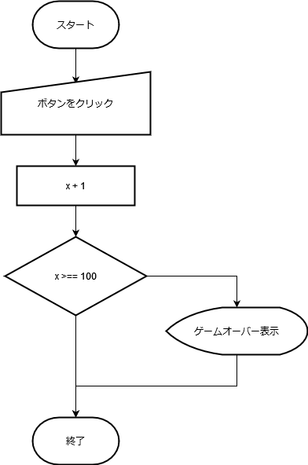

# コーディング  2nd Season
## 2週目「JavaScript」


---

1. 受講生MTG
1. はじめに
1. 座学
1. 実習
1. 講師FB
1. まとめ
1. 受講生MTG

note:
13:30～13:35 05分＞生徒の打ち合わせ
13:35～13:40 05分＞イントロ
13:40～14:05 40分＞座学
14:10～14:50 40分＞作業
14:50～15:05 15分＞FB
15:05～15:25 10分＞締め
15:25～15:30 05分＞生徒の打ち合わせ

---

## はじめに

--

### 先週の課題
「お気に入りを3分以内で紹介」

---

座学の時間
## JavaScript

---

空のHTMLファイルを用意して

---

### 変数スコープ

--

スコープとは参照できる範囲のこと

--

ところで“変数宣言”何があった？

--

宣言 | 内容
-------------|---------------
何もつけない      | グローバル
var      | 関数　再宣言可
let      | ブロック　再宣言不可
const      | ブロック　再宣言不可　定数
[変数宣言の種類]

--

スコープの種類

```txt
├── グローバルスコープ
└── ローカルスコープ
    ├──関数スコープ
    └──ブロックスコープ
```

--

実際に体験してみよう

---


### 配列

--

変数の一種  
複数の値をまとめて管理、格納できる

--

衣装ケースをイメージしてみて

<p><p/>

- Tシャツ
- パンツ
- 靴下

※1つの段にはひとつしかもの（値）が入らないよ

--

#### 配列の書き方

配列名 = [要素1, 要素2, 要素3,　…];

```js
wardrobe = ["Tシャツ", "パンツ", "靴下"]
```

--

#### 参照するには

全部の値：配列名;

```js
wardrobe
```

値を一つだけ：配列名[添え字];

```js
wardrobe[0]
```

※添え字は数字で0から始まります

--

記述 | 内容 | 例
-------------|---------------|---------------
length | 要素の数を調べる | wardrobe.length
push() | 最後に要素を追加 | wardrobe.push("ズボン")
pop() | 最後の要素を削除 | wardrobe.pop()
unshift()| 最初に要素を追加 | wardrobe.unshift("ハンカチ")
shift() | 最初の要素を削除 | wardrobe.shift()
[配列の操作1]

--

記述 | 内容 | 例
-------------|---------------|---------------
slice() | コピーするときなど | 後述
splice() | 任意の位置で追加や削除 | 後述
[配列の操作2]

--


```js
/**
 * slice(コピー開始の位置,コピー終了の位置+1)
 */

//a = wardrobe.slice(1,2);//1番目の要素から1番目の要素までをコピー
a = wardrobe.slice(1,4);//1番目の要素から3番目の要素までをコピー
console.log("sliceの結果：" + a);

```

--

```js
/**
 * splice(削除開始の位置,削除する要素数)
 */

wardrobe.splice(0, 1);// 0番目から1つの要素を消す
console.log("spliceの結果：" + wardrobe);

// 2番目から1つも要素を消さないで、その位置の後ろに要素を追加
letterCase.splice(2, 0, "ズボン");
console.log("spliceの結果2：" + wardrobe);

```

---

### API

--

アプリケーションプログラミングインターフェース

--

- Web API（ウェブAPI）の一覧リスト  
https://it-jog.com/wapi/webapis

- 【2022年最新】これは使える！種類別アプリAPI一覧  
https://engineer-style.jp/articles/1675


--

クジラWeb API
https://api.aoikujira.com/

---

### 何かを作るときのアドバイス


--

作るときには設計を

--

<p><p/>

--

- サイコロアプリ
- おみくじ
- アクセスするたびに違うメッセージ

--

ランダム

--

クリックゲーム

--

変数の管理

--

<p><p/>

---

## 実習

--

### 先週から変化があったか報告

--

14:10-14:50まで  
※休憩等は自由に

---

## 来週に向けて

--

設計を考えて発表する

--

### 予告

次週はCSSのお話し

SCSSも試したい。  
Preprosをインストールしておいてください。

以下のようなファイルも用意していおいてください。

```txt

[jissyu]（任意のフォルダ）
├ style.css
├ sorce.scss
└ index.html

```

