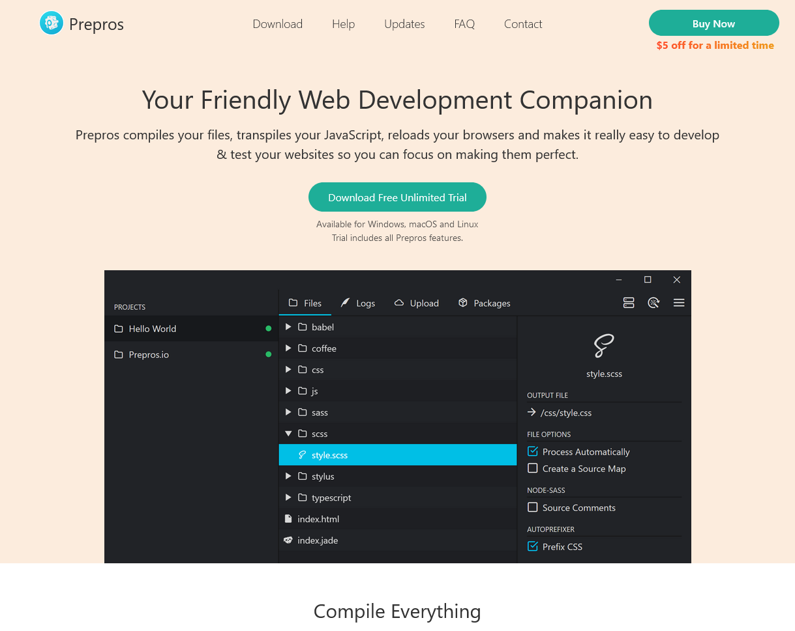
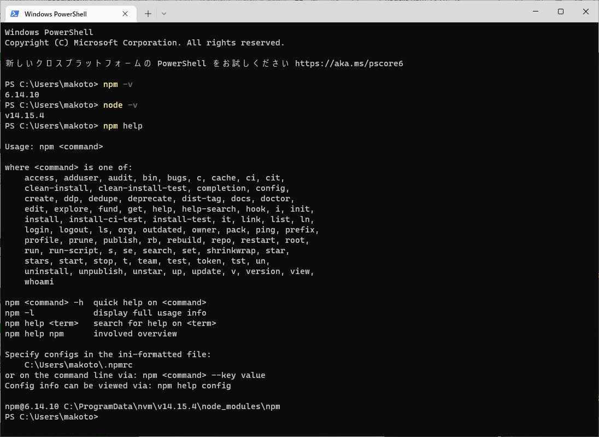
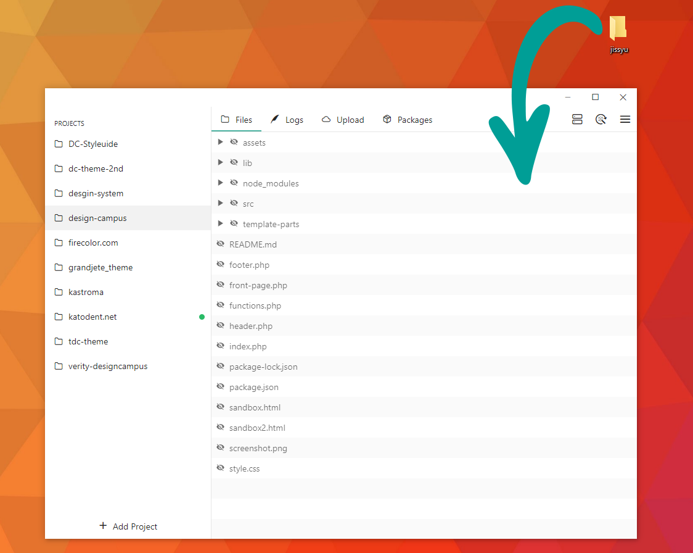

# コーディング  2nd Season
## 3週目「CSS」


---

1. 受講生MTG
1. はじめに
1. 座学
1. 実習
1. 講師FB
1. まとめ
1. 受講生MTG

note:
13:30～13:35 05分＞生徒の打ち合わせ
13:35～13:40 05分＞イントロ
13:40～14:05 40分＞座学
14:10～14:50 40分＞作業
14:50～15:05 15分＞FB
15:05～15:25 10分＞締め
15:25～15:30 05分＞生徒の打ち合わせ

---

## はじめに

--

### 先週の課題
「設計を考える」

---

座学の時間
## CSS

---

### 学習の前に

--

PreprosのインストールはOK？
<p><p/>

--

ファイルの用意もOK？

```txt

[jissyu]（任意のフォルダ）
├ style.css
├ sorce.scss
└ index.html

```

---

### 実務でのお話しを少し

--

- 吉野君にクライアントのサイトに1ページ追加をお願いした
- サイトのデータはGithubで共有したから自分で確認して
- 8年まえにリニューアル後、つぎ足しつぎ足しで秘伝の味

https://www.katodent.net/activity/sia.php


--

#### 画像の処理

--

小泉から渡し忘れてた  
↓  
原稿のWordから抜き出して使用

--

努力はえらい！  
けどNG

--

何を使うか確認しよう

--

そして、こっちが本題

--

サイズをどうするか

--

表示の2倍くらいが目安  

--

あとは圧縮は忘れずに

--

1. 圧縮率の高い形式を使用（WebPなど）  
https://squoosh.app/
1. 画像圧縮を使用  
https://tinypng.com/

--

ロゴなどの単純なデータはSVGを使用するのがベスト

---

### ポートフォリオのCSSを振り返る

---

### SASS（SCSS）について

--

"Dart Sass"と"Lib Sass"

--

SASS記法とSCSS記法がある  
※ファイルの拡張子も.sassと.scssでわける
--

Node.jsやらNPMやらをコマンドラインで
<p><p/>

--

設定ファイルものいろいろだし、書き方の変化も早い

--

つらい人にはつらい

---

### Preprosの使い方

--

基本はフォルダをアプリの画面にドラッグ&ドロップ
<p><p/>

--

ソースとなるファイルと変換先の確認は忘れずに

---

#### まずはHTMLを

--

```html

<div class="demo01">
    <p>Sass</p>
    <span>Scss</span>
</div>
<div class="demo02">
    <p class="demo02_pra">demo</p>
</div>


```

---

#### Sassって便利、その１
入れ子（ネスト）

--

```scss
.demo01 {
    p {color: red;}
    span {color: blue;}
}
.demo02 {
    &_pra {background: green;}
}
```
↓
```css
.demo01 p {color: red;}
.demo01 span {color: blue;}
.demo02_pra {background: green;}
```

--

参考：SASS記法

```sass

.demo01
    p
        color: red
    span
        color: blue

.demo02
    &_pra
        background: green


```

--

```scss
.demo01 {
    p {color: red;}
    @media only screen and (max-width: 640px) {
        p {color: yellow;}
    }
}

```
↓
```css
.demo01 p {color: red;}
@media only screen and (max-width: 640px) {
    .demo01 p {color: yellow;}
}


```

---

#### Sassって便利、その2
@extend(継承)

--

```scss
.demo01 {
    padding: 1rem;
    background: gray;
}
.demo02 {
    @extend .demo01;
    border: 1px solid black;
}
```
↓
```css
.demo01 {
    padding: 1rem;
    background: gray;
}
.demo02 {
    padding: 1rem;
    background: gray;
    border: 1px solid black;
}
```

---

#### Sassって便利、その3
@mixin

--

```scss
@mixin borderRadius {
    border-radius: 8px;
}

.demo01 {
    @include borderRadius;
}
.demo02 {
    @include borderRadius;
}
```
↓
```css
.demo01 {
    border-radius: 8px;
}
.demo02 {
    border-radius: 8px;
}
```

--

引数も使える

```scss
@mixin borderRadius($radius: 8px) {
    border-radius: $radius;
}

.demo01 {
    @include borderRadius();
}
.demo02 {
    @include borderRadius(16px);
}
```
↓
```css
.demo01 {
    border-radius: 8px;
}
.demo02 {
    border-radius: 16px;
}
```

---

#### Sassって便利、その4
いろんな色

--

```scss
$baseColor: #3FC9CA;

.demo01 {
    background: $baseColor;
}
.demo02 {
    background: lighten($baseColor, 10);
    // background: darken($baseColor, 100);
    // background: saturate($baseColor, 50);
    // background: invert($baseColor);
    // background: mix($baseColor, red, 50);
}

```
↓
```css
.demo01 {
    background: #3FC9CA;
}
.demo02 {
    border-radius: #67d4d5;
}
```

---

#### Sassって便利、その5
別のファイルを読み込んでひとつのファイルに

--

```scss
//Lib Sass
@import 'ファイル名1';
@import 'ファイル名2';

//Dart Sass
@use 'ファイル名1';
@use 'ファイル名2';

```

---

#### Sassって便利、その6
他にもいろいろ便利な機能があるから、調べてみて

--

```scss
@function pxToRem($px, $baseSize: 16) {
    @return $px / $baseSize * 1rem;
}

.demo02 {
    font-size: pxToRem(24);
}


```
↓
```css
.demo02 {
    font-size: 1.5rem;
}
```
--

```scss
$breakpoint: (
    tab: 'screen and (min-width: 600px)',
    pc: 'screen and (min-width: 1000px)'
);
@mixin mq($bp) {
    @media #{map-get($breakpoint, $bp)} {
        @content;
    }
}
.demo02 {
    @include mq(pc) {
        background: white;
    }
}
```

---

## 実習

--

### 先週から変化があったか報告

--

14:10-14:50まで  
※休憩等は自由に

---

## 来週に向けて

--

実習課題を完成させる

--

### 予告

--

次週はHTMLのお話し  

あとは実習課題をサーバーにアップ。  
みんなに見てもらいながら発表しましょう

--

#### Xfreeサーバーに関して

--

SVGを使っている場合は.htaccessに以下を追加

```txt
AddType image/svg+xml .svg .svgz
AddEncoding gzip .svgz
```

--

あとはそもそもファイル名に日本語とか2バイト文字使っちゃだめよ

--

それではまた来週を楽しみにしています！

note:
https://design-campus.net/practice/ts-0/ikeda/
https://design-campus.net/practice/ts-0/kuwabara/
https://design-campus.net/practice/ts-0/yoshino/